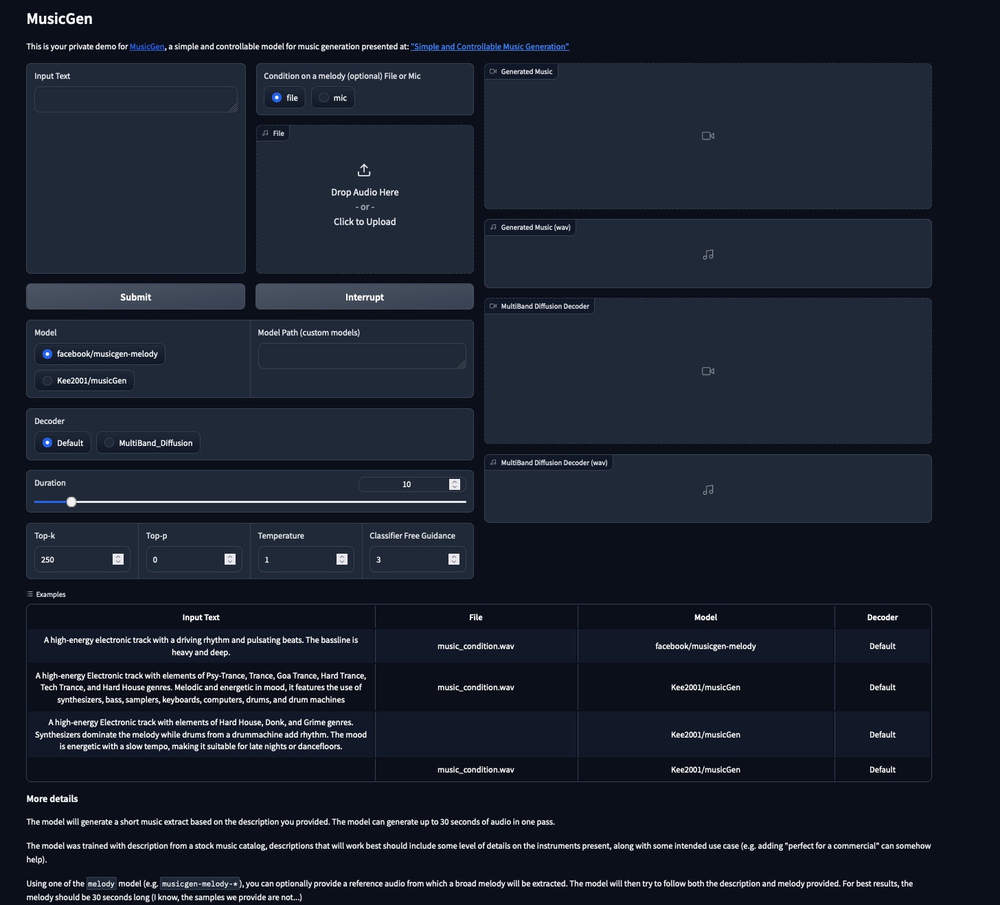
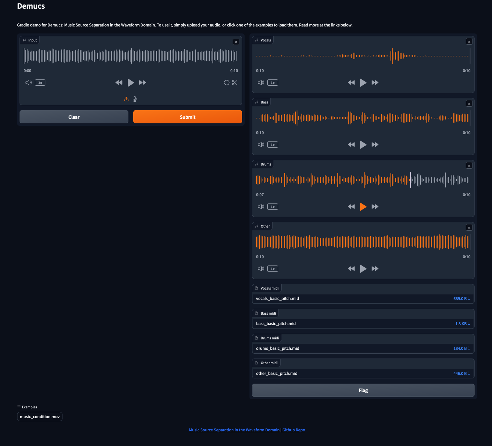

# Music-compose assistant model. 
Support: music generation (conditioned by text+melody or text), music source separation, music2midi 

## Setup
```bash
$ bash setup.sh
```

## Music compose app

```bash
$ bash musicgen.sh
```
`Click the link shown in the terminal, usually 'http://127.0.0.1:7860/'`

Currently there is 2 models: 
* facebook/music-melody (pretrained model from Meta, 1.5B params) 
* Kee2001/musicGen (finetuned model on our data, 300M params)



## Music source separation and convert to midi format app

```bash
$ bash music2midi.sh
```
`Click the link shown in the terminal, usually 'http://127.0.0.1:7860/'`

